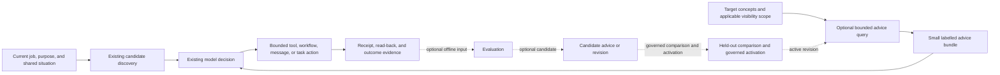

# Represented Advice for Adaptive Von Behaviour

- **Kind:** Design proposal
- **Lifecycle:** Draft
- **Authority:** Advisory proposal under `AGENTS.md`; it does not define live
  runtime behaviour, grant effect authority, or make advice retrieval mandatory
- **Authority scope:** Von-authored defeasible guidance for role, capability,
  workflow, tool, knowledge-acquisition, introspection, message, and task
  decisions
- **Owner:** Von maintainers
- **Current implementation and retrospective:**
  [JVNAUTOSCI-2719](https://naoinstitute.atlassian.net/browse/JVNAUTOSCI-2719)
  and [JVNAUTOSCI-2720](https://naoinstitute.atlassian.net/browse/JVNAUTOSCI-2720)
- **Last reviewed:** 4 September 2026
- **State or evidence as of:** Public Von
  `dc84fc1a850890b32b89bdc8b3e0da96cfce4264`, a read-only audit of the
  configured Vontology and workflow-instance store on 4 September 2026, and
  the repository subtraction, non-active candidate implementation, and isolated
  experiment support described below. The JVNAUTOSCI-2720 read-only preflight
  succeeded, but no live experiment result, production activation, or
  deployment is claimed yet
- **Supersedes / superseded by:** Nothing. This proposal owns represented-advice
  semantics, applicability, retrieval/projection, lifecycle, and retraction;
  the broader
  [automated-policy-learning design](automated_policy_learning_design.md)
  retains actor-critic, candidate-generation, evaluation, and promotion scope
  and defers its textual-guideline details here
- **Review trigger:** Experience or discussion yields a potentially reusable
  candidate; a concrete runtime consumer is selected; an autonomous maintenance
  canary is proposed; or a general advice vocabulary/projection is proposed

## 1. Decision summary

Von should explore represented advice, but should not begin by building a new
universal advice subsystem.

There is nevertheless a credible unification path. Von can converge the soft,
defeasible parts of its current guidance surfaces on a **shared interchange,
projection, and lifecycle protocol**, while leaving decision semantics,
authority, storage, ranking, and specialised policy with their existing
owners. This is a federated maintenance and projection protocol for advice,
not a universal advice ontology, central ranker, authority plane, or mandatory
runtime service.

The proposed meaning is:

> **Advice is a short, provenance-bearing, defeasible text artefact authored by
> Von, retained as policy memory, and linked to the roles, concepts,
> capabilities, workflows, stages, or decision kinds for which it may improve a
> later judgement.**

“Policy memory” here uses the broad category already defined by Von's memory
architecture; it does not make advice an enforceable policy or invariant.

Advice is a revisable hypothesis about how Von might do better. It is not an
instruction, fact, workflow transition, permission, commitment, or proof that
its originating diagnosis was correct. The model making the existing decision
may use, adapt, or reject it in light of the governing objective and purpose,
shared situation, available capabilities, and observed evidence.

Learning from experience and discussion is a central purpose of the Von
architecture, not an exception invoked only after repeated failure. A
conversation may expose a useful correction, rationale, method, local practice,
successful strategy, or conjecture before telemetry supplies a recurring
failure class. Von should be able to preserve that as an attributed, non-active
candidate without making it a prompt instruction or production policy.

The gates are therefore deliberately separate:

- **candidate formation** asks whether an experience or discussion contains a
  material, potentially reusable lesson worth retaining; the minimum is its
  body, contributor/source, and intended target, with richer evidence or
  lifecycle structure added only when actual reuse needs it;
- **runtime activation** asks whether a concrete consumer and outcome comparison
  show that the candidate helps; and
- **autonomous promotion or revision** asks whether the evidence and standing
  authority justify changing the active projection without human intervention.

The Reliability Ratchet constrains active projection and generalisation; it
must not become a reason for Von to avoid learning or to discard a useful
discussion simply because production efficacy has not yet been tested.

The Phase 0 design decision is therefore:

1. treat advice as a **semantic role and lifecycle contract** over existing
   Vontology text, profiles, and policy-memory mechanisms;
2. subtract the dormant workflow-experience producer, evaluator-facing
   projection, and unpopulated selected-workflow policy-memory injector before
   publishing a general `Advice` ontology or inserting another model stage;
3. require any future advice lookup to be optional, batched, scoped where its
   source or target requires it, and unable to remove candidates or enlarge
   authority;
4. reify a first-class advice individual only when independent identity,
   cross-target reuse, revision, evaluation, or retraction earns that extra
   representation; and
5. remove or collapse the mechanism if the same content works as well in an
   existing prompt or workflow profile.

The bounded Phase 0.5 implementation makes the positive half of that decision
concrete. It adds an agent-reachable `learning_candidate.v1` artefact and
`capture`, `get`, `list`, and `revise` operations for a material lesson linked
to an actor- or organisation-visible conversation or episode critique.
An unmaterialised chat-history session is the narrower actor-owned source form.
The body is a canonical `hasDescription` relation; compact structured metadata
keeps source, contributors, target, audience, beneficiaries, purpose,
visibility, revision history, and Von authorship distinct. Its lifecycle remains
`non_active`; experimental evidence may give the exact revision an inspectable
`undecided`, `retained`, `rejected`, or `retracted` disposition without making
it active. Ordinary turns perform no automatic capture, selection, evaluation,
activation, or promotion.

JVNAUTOSCI-2720 adds an explicitly invoked, fixture-bound Phase 1 experiment.
It can ask Von to form one candidate from a frozen source discussion, compare
the exact bytes as an optional sidecar against a truly withheld control at the
existing direct-adaptive model call, evaluate the trials blindly, and record a
canonically recomputed disposition. This is experiment-local projection, not
an ordinary runtime advice consumer. Candidate formation is learned policy
memory; behavioural efficacy and the value of represented retrieval remain
separate empirical claims.

If the first local consumer and a second independently motivated consumer both
earn reuse, they may share this lifecycle vocabulary while retaining
consumer-owned loops:

> evidence → candidate revision → scoped active selection → bounded projection
> → observed outcome → revision, graduation, expiry, or retraction

The shared vocabulary makes maintenance interoperable; it does not create one
central maintainer or decide the underlying tool, workflow, acquisition,
message, task, or role question for every consumer.

The broader identity decomposition, active lifecycle terms, maintenance worker,
and later role application below remain candidate mechanisms, not a package to
implement together. Explicit MCP reads can expose candidate text to a calling
model for deliberation. The Phase 1 runner can also supply one exact candidate
revision to an isolated decision call, but no ordinary active binding, resolver,
or configured production projection is selected. Later machinery is adopted
only when the preceding evidence independently earns it.

This design is intended to keep useful conjectures revisable for longer. It
would fail its purpose if every disappointing episode simply became another
permanent paragraph in Von's context.

## 2. Advice's place in Von's cognitive architecture

Several nearby artefacts contain text, but they do different jobs:

| Artefact | Question it answers | Authority |
|---|---|---|
| Observation or episode | What happened? | Evidence only |
| Assertion or domain knowledge | What is put forward as holding in a context? | Epistemic content with provenance; not automatically true |
| Advice | What might help at this decision, and under what circumstances? | Defeasible advisory policy memory |
| Prompt or role policy | How should this model stage generally behave? | Authored behaviour within its selected scope |
| Workflow | What reusable process can be executed and recovered? | Executable procedure whose effects remain independently authorised |
| Capability or authority boundary | What may the actor and system do? | Hard maximum access and effect boundary |
| Task or commitment | What work has been undertaken? | Durable obligation or external coordination state |

Advice may influence a decision within these boundaries, but it does not alter
their meanings. In particular:

- advice about a tool does not make the tool available or authorised;
- advice about a workflow does not establish that the workflow ran;
- advice about a knowledge-acquisition goal is not acquired knowledge;
- advice to inspect something is not diagnostic evidence;
- advice to send a message or create a task is not authority for that effect;
- advice about a role does not assign the actor new responsibilities or
  permissions; and
- repeated advice does not become an invariant merely through repetition.

A stable, broadly applicable lesson may eventually be incorporated into a
prompt or workflow. A concrete unacceptable outcome may justify an exact code
or authority boundary. Those are separate promotion decisions. When advice is
replaced by a stronger artefact, the active advice should be retired rather
than left as a second route saying the same thing.

## 3. Intended value and counter-hypotheses

The job is not “retrieve advice”. It is for Von to help a person, a human/AI
team, or an organisation recognise and carry out a useful role, choose an
adequate route, produce the relevant work product, and recover intelligently
with low latency and human burden. Some roles have no immediate user. Their
purpose and evidence may instead concern a team, an organisation, a social
group, society, humanity, or the Earth and its ecosystems.

These levels are not interchangeable. Contributor, acting principal, target
role, audience, beneficiary, and purpose remain distinct where the work needs
them. A broader purpose does not grant authority or establish one uncontested
good; it identifies whose purpose is represented and which work product,
affected parties, competing values, or real-world consequence may matter to the
claim. Do not collapse them into user satisfaction, organisational convenience,
or one scalar reward.

Represented advice could help through four causal mechanisms:

| Claimed benefit | Plausible mechanism | Important counter-hypothesis |
|---|---|---|
| Faster | Avoid a known bad route, redundant discovery, unnecessary model call, or low-value question | Lookup, ranking, and extra prompt tokens cost more than the avoided work |
| More effective | Reuse local practice and prior recovery knowledge across turns without hard-coding it | Stale advice anchors the model and displaces better current judgement |
| More accurate | Prompt acquisition of missing evidence, preserve source limits, and recall failure patterns | Advice preserves a mistaken causal story and makes errors more coherent |
| Better role and purpose fit | Retrieve advice linked to the current role, responsibility, work product, organisation, beneficiary, purpose, and handoff | Generic role advice becomes a stereotype or fossilised process that conflicts with the actual situation or wider purpose |

All four are hypotheses. A shorter prompt, better workflow description, better
tool metadata, stronger suitable model, or no extra mechanism may win.

Advice is particularly promising where all of the following hold:

- the decision remains semantically contingent rather than a hard invariant;
- experience has value beyond one episode;
- the lesson needs revision, provenance, or reuse independent of a large base
  prompt;
- a consumer can retrieve it cheaply at an existing decision point; and
- success and negative transfer can be observed on the relevant work product or
  end-to-end outcome at the appropriate person, team, organisation, or wider-
  beneficiary level.

It is a poor fit for an exact interface constraint, a one-off case judgement,
raw telemetry, a long procedure that should be a workflow, or a platitude a
capable model already follows reliably.

Against Von's longer-term aims, the intended contribution is specific:

- **reliable:** expose which revisable guidance affected a choice, preserve
  counterevidence, and make withdrawal and recovery cheaper than another code
  release;
- **knowledgeable:** use concept links to find relevant practice and recurring
  evidence gaps, while leaving facts and acquired knowledge in semantic memory
  rather than laundering them into advice;
- **adaptive:** bind revisions to roles, workflows, stages, actors, teams, and
  changing model/tool dependencies without freezing one global rule;
- **autonomous:** let Von perform bounded proposal, comparison, drift detection,
  revision, and retraction through independently governed workflows;
- **minimal-imposition:** reduce repeated discovery, clarification, approval,
  and correction while spending human attention only on materially different
  value, authority, publication, privacy, or coordination choices; and
- **team-effective:** retain who proposed, corrected, approved, or disputed a
  practice and support better work products and handoffs without turning team
  custom into universal policy; and
- **organisation- and purpose-effective:** learn roles, knowledge, and practice
  that serve an organisation or a wider social or ecological purpose even when
  no particular user is the immediate beneficiary, while keeping whose purpose
  and evidence it is inspectable.

## 4. This is not greenfield

The repository contains several overlapping advice-like surfaces and now
records one retired prototype:

| Existing surface | What it already provides | Design consequence |
|---|---|---|
| [`workflow_routing_profile.v1` and workflow discovery exemplars](../../src/backend/workflows/vontology_loader.py) | Vontology profiles store and carry routing role, direct-equivalence, selection guidance, examples, exclusions, and routing notes; current selector candidate rendering does not explicitly project `selection_guidance` | Audit and reuse the stored field deliberately if it proves useful; launchability remains independently established, and storage alone does not change selection |
| Retained episode evidence and critique memory | TERs, episode evidence bundles, evaluator axes, critic assessment, implicated workflows/tools/concepts, receipts, remediation links, and structured `episode_improvement_suggestion.v1` items remain persisted in `episode_critique_memory.v1` | Use this as a source-native observation and candidate substrate after checking its evidence and quality; do not rebuild it or mistake a critic suggestion for validated advice |
| Workflow Studio improvement guidance | The current human-facing workflow detail view lists recent critique suggestions with target, category, rationale, proposed change, evidence references, and source episode, and explicitly does not auto-apply them | Treat this as an existing candidate-discovery consumer for human deliberation, not as a model-facing runtime advice consumer or efficacy proof |
| Retained explicit evaluation and workflow self-improvement paths | Explicit episode evaluation can persist critique memory; represented proposal and promotion-recommendation workflows can turn a selected workflow suggestion into an isolated workflow candidate | Reuse only when a real selected candidate needs them; the live critique projections record no self-improvement launches, proposals, or promotion evaluations, so their operational loop is unproven |
| Retired workflow-experience guidance induction | The audited repository path attempted to author successful-run, failure-avoidance, and exploration text after every persisted episode assessment | Preserve those three purposes as optional lenses, but do not republish the forced producer; current criticism is repair-oriented and does not replace positive-practice or exploratory learning |
| Retired `#V#workflow_experience_context_prelude` | The audited prelude derived a workflow/model profile and read the latest five values of three additive relations for four direct proposal/evaluation/release callers | Replace the live-capable graph with an unpublished, actionless terminal tombstone and keep it out of those callers; recency was not activation, applicability, deduplication, or independent evidence |
| Retired selected-workflow policy-memory projection | A separate critique-memory-backed builder had no in-repository caller, while the orchestrator could still render caller-supplied suggestions as system text | Remove the builder, renderer, turn-stage injection, and misleading lineage path; retain the suggestion store and Workflow Studio discovery without treating unselected model output as promoted policy |
| [Tool planner hints](../../src/backend/services/tool_metadata_service.py) and [outcome-explanation maps](prompt_programs_and_model_routing_playbook.md#3b-outcome-explanation-guidance) | Specialised model-facing guidance at established tool and explanation surfaces | Keep domain-specific shapes where they are the simplest adequate representation |
| [Knowledge-acquisition profiles](../../src/backend/services/knowledge_acquisition_profile_vontology_service.py) | Typed defaults, thresholds, auto-application, and fail-closed behaviour | Treat these as stronger acquisition policy requiring its own ratchet review, not generic soft advice |
| [Publication-scope profiles](ontology_publication_authority.md#represented-publication-scope-profiles) | A concrete code-level precedent for defeasible Vontology advice separated from mutation authority | Reuse its boundary, not the domain schema or resolver unchanged: an invalid accessible profile can currently invalidate the decision, protected outcomes dominate ordinary conflicts, and add-only seed reconciliation can resurrect removed profiles |
| [Workflow selection experience and policy](../../src/backend/services/workflow_selection_policy_service.py) | Process-global outcome-derived numeric priors, lexical token affinity, and exploration signals that advise the selector while leaving semantic choice to the model | Treat this as a competing diagnostic baseline, not privacy-compatible production advice until its population and scope are isolated |
| [Operational learning release support](../../src/backend/services/operational_learning_release_vontology_service.py) | Candidate evaluation, artefact-specific active pointers, receipts, rollback, and exact namespace/user/organisation scope | Reuse proportionately for consequential promotion in that supported scope; it is not yet a general private-advice lifecycle and must not be imposed on every hint |

The retired workflow-experience implementation supplied direct evidence of a
ratchet in the surrounding Python, tests, seed migrations, and Jira/design
record, plus plausible mechanisms by which represented guidance *could*
accumulate:

- one episode-evaluation path renders and writes all three guidance kinds,
  including a literal “no durable lesson” fallback;
- the three additive writes are sequential, so a later failure can leave a
  partial set; the pilot must first establish whether that partial set is
  harmful or the hints are independent, in which case idempotent writes with
  receipts are preferable to an unnecessary transaction;
- its gateway test deliberately permits another relation containing the same
  guidance body but a different request identifier;
- the retrieval prelude reads the latest five relations for each of three
  predicates, rather than an active, deduplicated, applicability-aware view;
  and
- its profile key contains workflow and model but the retrieved items are not
  filtered by their recorded stage, supersession, expiry, utility, or
  retraction state.

It did **not** supply evidence that a ratchet had occurred in Von's knowledge
structures. The bounded live audit found no populated guidance to preserve or
promote. In the configured database there were zero text relations and zero scoped
assertions across all three guidance predicates, zero distinct linked guidance
profiles, and zero recorded prelude workflow instances. Subworkflow invocation
need not always create a separate instance, so the instance count alone is not
proof of non-execution; the empty guidance stores and source/runtime path are
the stronger evidence of dormancy.

The same audit found 134,215 episode-evaluation workflow instances. The latest
100 by indexed creation time contained 81 cancelled and 19 failed instances,
with no success; the latest five failures stopped at the episode-evaluation
model step before assessment persistence or guidance induction. Before this
repository change, the completion-gate binding was enabled, the terminal-event
binding was disabled, and the integration defaulted automatic triggering on.
These observations distinguish a failing automatic producer from a useful
advice capability; they do not establish the state of every historical
instance or justify deletion of raw evidence.

This satisfies the Phase 0 stop rule for the unused runtime mechanism, not a
stop rule for learning from experience or discussion. The repository
implementation therefore removes the guidance authoring tail, prompt
registration and seed vocabulary;
replaces the live-capable prelude with an unpublished, actionless terminal
tombstone; removes its four proposal/evaluation/release injections and the same
three retired history fields from 17 other LLM states that could still project
caller- or parent-supplied values; and defaults both
episode-evaluation bindings and the integration trigger off. On
repository bootstrap, canonical lifecycle write and read-back also mark the
tombstone retired and routing-ineligible. Explicit episode evaluation and raw
episode evidence remain. No live ontology artefacts or historical instances
were deleted, and this change is not a live deployment. A future resolver must
still never translate “latest” into “promoted”.

The durable worker currently begins polling before these non-critical workflow
families finish their startup migrations. A bounded live read found no pending,
running, or paused instances for the retired prelude, episode evaluators,
self-improvement workflows, or affected operational-learning workflows, so no
present instance was found that could exercise that window. A future deployment
must inspect its actual worker topology and pending instances before deciding
whether quiescence is needed; this repository change supplies no evidence for a
universal quiescence requirement and does not claim rolling-deployment safety.

The separate selected-workflow policy-memory builder read recent critique
suggestions from Mongo. A static source scan found no in-repository caller of
the builder, but the orchestrator would still render a caller- or parent-supplied
`selected_workflow_policy_memory_state` as system text in tool-planning and
synthesis contexts, and record it as lineage. Its source query also made
`namespace` optional and had no independent user/organisation access check.
Phase 0 therefore removes the builder, renderer, two turn-stage injections, and
lineage projection rather than preserving a dormant authority aperture.

The retired episode-evaluation autotrigger default and completion-gate binding
could launch a large amount of failing work. They now default off; explicit
episode evaluation remains available. If later evidence identifies a worthwhile
recurring maintenance job, compare a separate asynchronous batched process with
the simpler direct path rather than piggybacking on every episode.

Operational-learning releases provide valuable immutable-candidate, scope,
expiry, pointer, receipt, and rollback mechanics, but cannot be reused
unchanged. Registration currently requires failure-evidence packets, although
useful advice may arise from success or exploration, and rollback requires a
previous active release rather than supporting first-release retraction to the
ordinary empty/no-advice state.

These mechanisms also do not share one visibility model. Some reads use an
ambient actor-effective Vontology view, some use the base-publication view,
tool metadata uses a process-global catalogue cache, and the latent critique
path accepts an optional namespace. A general resolver cannot inherit any one
of those behaviours unchanged.

### 4.1 Teleological reading of the retired feedback loops

Retirement is a judgement about the implemented causal path, not necessarily
about the purpose that path was trying to serve:

| Intended function | What should survive | What should remain retired |
|---|---|---|
| Notice experience continuously | Durable episodes, TERs, receipts, explicit evaluation, and bounded sampling or event selection | An extra LLM and mutation tail attached to every episode without a demonstrated learning consumer |
| Learn what worked, what failed, and what to try next | Successful practice, failure avoidance, and low-imposition exploration as optional candidate lenses; allow zero, one, or several lessons from experience or discussion | Requiring all three outputs for every episode and storing a literal “no durable lesson” as guidance |
| Make a lesson reusable in its context | Source workflow/model/stage can be useful applicability evidence; roles, work products, teams, organisations, beneficiaries, and purposes may also be the right target | Creating durable `unknown_workflow`/`unknown_model` profiles or projecting stage-mismatched items |
| Preserve lessons outside code | Vontology remains a plausible home when independent identity, linking, revision, or reuse earns it; source-native conversation or critique memory is enough before then | Immediate additive writes whose mere recency stands in for selection, applicability, or activation |
| Bring prior experience to a later decision | Discover non-active candidates for human/AI deliberation, then project only a deliberately selected candidate at a concrete decision point | Latest-N injection, raw caller-supplied history as system text, or candidate history in its own evaluation/release context |
| Turn findings into maintained improvements | Workflow Studio inspection, bounded task/proposal handoff, evidence-linked candidate worlds, and later outcome comparison | Hard-coded escalation thresholds or automatic Jira/promotion behaviour copied into advice merely because those mechanisms exist |

The live critique store is therefore evidence and research material, not waste
and not already-learned policy. A bounded read on 4 September 2026 found 2,083
`episode_critique_memory` projections in the configured namespace: 585 pass,
240 fail, 604 inconclusive, and 654 follow-up-required. Of these, 583 contained
2,118 structured improvement suggestions spanning workflow, telemetry, prompt,
tool, contract, verification, critic, and support surfaces. The data also shows
why direct activation would be unsound: 610 memories lacked workflow identity,
1,291 lacked a routing fingerprint, the latest 20 were all inconclusive with no
suggestions, generic identifiers such as `s1`–`s5` recur across unrelated
workflows, and no projection recorded a self-improvement launch, proposal, or
promotion evaluation. Repeated suggestions may be useful recurrence evidence;
they are not 2,118 independent lessons or proof that the suggested change helps.

Use this corpus to study evaluator behaviour, recover concrete candidate ideas,
and link recurring observations back to code, tests, Jira, discussions, and
outcomes. Re-ground any candidate before reuse. The 134,215 workflow instances
are likewise operational evidence about the failed mechanism and its cost, not
134,215 learning events. No historical instances, critique memories, or raw
episode evidence are deleted by Phase 0.

The positive gaps are now sharper. Phase 0.5 supplies attributed
discussion-to-durable-candidate capture plus AI discovery and revision of
non-active candidates outside workflow-only Studio views. Successful-practice
induction, optional low-imposition exploratory lessons, a unified human
candidate view, and selected-advice exposure-to-outcome lineage remain
unimplemented. None requires restoring the retired loop.

Role advice is not a shortcut around role representation. The
[programme design](Von_for_AgenticAI.md) describes a represented role with
responsibilities, authority, workflows, and work products, while the current
[task-ontology service](../../src/backend/services/task_ontology_service.py)
uses role primarily as text framing. Role-linked advice can therefore be
captured when experience or team discussion supplies a potentially reusable
lesson. The role may serve a person, team, organisation, community, humanity,
or ecological system and need not involve a direct user. When material, keep
its contributors, acting principal, beneficiary, purpose, target identity,
responsibilities, and intended scope inspectable rather than treating any one
of those as a proxy for the others. Activating advice still requires a concrete
role decision and outcome evidence appropriate to its work product or purpose;
candidate capture is not a shortcut to assigning responsibilities or authority.

### 4.2 The unification boundary

The useful commonality is deliberately narrower than “everything that guides a
decision”. A shared layer may own:

- stable advice/revision identity and exact target links;
- provenance, evidence lineage, visibility, lifecycle, and removal triggers;
- mechanical proposal, compare-and-set selection, supersession, retirement,
  rollback, and exact read-back operations executed only from the consumer's
  authorised release decision;
- a bounded visibility-safe projection contract and failure diagnostics;
- exposure/outcome telemetry, dependency drift signals, and token budgets; and
- reversible adapters through which an existing surface exposes soft advice
  without migrating its native schema.

The consumer or specialised policy continues to own:

- domain applicability beyond exact target matching;
- relevance, conflict interpretation, and decision-specific evaluation;
- whether and where advice enters its existing model call;
- the final action choice and its independent authority checks;
- native storage and stronger prompt, workflow, score, or policy semantics; and
- activation, retirement, and rollback decisions and promotion criteria
  appropriate to the consequence and audience.

The following soft components are plausible convergence candidates:

- future workflow-local success, failure-avoidance, and exploration guidance
  that is independently motivated rather than restored from the retired path;
- the `selection_guidance` portion of workflow routing profiles, but not
  eligibility, launchability, routing role, or direct equivalence;
- evidence-conditioned or scope-specific tool-planner prose, while static
  global tool descriptions may remain metadata;
- recovery, introspection, role-practice, message-structure, task-practice, and
  explanatory advice once their target and outcome identities are represented.

The following remain specialised even if they reuse versioning, evidence, or
release primitives:

- workflow control flow, postconditions, and deterministic follow-up actions;
- tool schemas, availability, dispatch, and effect authority;
- knowledge-acquisition thresholds, automatic application, and fail-closed
  behaviour;
- publication-scope semantics and protected-carrier conflict handling;
- prompt bodies and outcome-explanation maps;
- numeric workflow/model-routing policies;
- roles, tasks, commitments, assertions, and raw episodes; and
- security, visibility, and authority boundaries.

An adapter may expose an explicitly soft projection from one of these stronger
surfaces. It must not relabel the whole source as advice or weaken its native
semantics. If a common implementation starts acquiring tool-, workflow-,
publication-, or role-specific branches, move those semantics back to the
consumer or abandon the abstraction.

## 5. Design principles

1. **The current job and purpose lead.** Advice supplements the explicit
   request, represented role or organisational objective, broader purpose, and
   shared situation that actually govern the work; it does not redefine them or
   assume that a particular user is the beneficiary.
2. **Preserve alternatives.** Advice may change model-visible salience or
   ranking. It must not remove an otherwise authorised tool, workflow, direct
   route, recovery, or answer strategy.
3. **Advice is not authority.** Trusted context determines visibility; the
   acting principal and delegation determine capability. The eventual effect
   independently verifies authority.
4. **No universal advice stage.** A consumer opts in at an existing decision
   point only when prior evidence suggests advice could change the outcome.
5. **Use the weakest adequate representation.** Attached text is preferable to
   a new first-class individual until reuse, lineage, or retraction needs more.
6. **Retrieve a small relevant view, not a history.** Raw episodes and retired
   advice remain auditable but do not enter the prompt by default.
7. **Absence is normal.** Missing, inaccessible, malformed, or slow advice must
   not block an otherwise viable task. Readable alternatives remain usable.
8. **Keep conflicts visible.** “Newest”, “most specific”, “most restrictive”,
   and “highest confidence” are not universal conflict-resolution rules.
9. **Do not self-govern.** Advice may propose a future resolver or evaluator
   change, but it cannot select, rewrite, or supply the success criteria for the
   resolver, evaluator, authority boundary, or activation policy governing its
   current revision. Such a proposal needs a separate release and independent
   evaluation.
10. **Deletion is a successful outcome.** Every production adoption has an
    observable condition under which the advice or mechanism will be retired.
11. **A risk hypothesis earns observation, not machinery.** Do not add a
    compulsory guard, schema, review stage, test matrix, or promotion ceremony
    merely because harm is imaginable. First identify a concrete materially
    unacceptable outcome, show by evidence or a clear causal path that it is
    reachable in the proposed Von surface, and show why a simpler bounded,
    observable, and recoverable approach is inadequate. Until then, record or
    measure the uncertainty without constraining the architecture around it.

Von authorship is not a content-safety boundary. Retrieved mail, web pages,
documents, tool output, and prior model text remain untrusted evidence even
when an evaluator summarises them into a candidate. Advice activation must not
launder source instructions into higher-priority policy.

Promoted advice remains untrusted advisory data at consumption time. It must be
rendered as a labelled, defeasible input below the current objective, purpose,
role, commitments, observed facts, and any governing user instruction. It must not be
injected as an undifferentiated system instruction or acquire higher
instruction priority merely through representation or promotion.

## 6. Representation

### 6.1 Two adequate forms

| Form | Use when | Avoid when |
|---|---|---|
| Text relation attached to one target or versioned profile | A simple candidate has one owner and consumer, while an enclosing profile or index owns any active revision | A raw attached relation itself needs revision, supersession, retraction, or separately accumulated evidence |
| First-class advice knowledge item linked to targets | The same advice is reused, revised, evaluated, contradicted, or retracted independently across several concepts or workflows | A new node would only wrap one existing prompt or profile field |

A future first experiment should use the source-native profile or attachment
surface already owned by its selected consumer, not resurrect the retired
workflow-experience substrate by default. Its represented arm needs an isolated
explicit manifest or pointer for the candidate and active revision; raw
additive relations do not acquire lifecycle merely because they are in
Vontology. A general advice item must still earn its ontology layer.

For advice that has earned runtime projection, whether stored natively or
exposed through an adapter, the minimum external logical contract is:

- stable advice and revision identity when the release can change independently;
- one concise body;
- an inspectable target, using concept identifiers only where the target is
  already represented that way;
- producer, provenance, and evidence references;
- a visibility carrier only where the source or target is not public, resolved
  from trusted actor context and kept distinct from target and evidence context;
- lifecycle sufficient to identify what is active and what replaces or removes
  it, using an enclosing source-native profile where that is adequate;
- a removal, review, or retest condition for every active production item; and
- an inspectable reason why the item was retrieved.

When not unambiguously supplied by the exact target/carrier, the contract must
also include decision kind and applicability. Only when material to an item
should it add:

- model, prompt, workflow, tool, or ontology-version dependence;
- calibrated confidence or utility evidence;
- counterevidence;
- an explicit relationship to competing advice.

This is deliberately not one compulsory source schema or JSON envelope with
fourteen fields. Existing Vontology relations, specialised profiles,
text-relation context, revision records, and evidence locators may supply the
contract through reversible adapters. Before publishing new predicates,
implementation must search for and reuse the current lifecycle, provenance,
scope, and supersession vocabulary.

If the operational-learning release vocabulary is reused, the provisional
mapping is candidate to `proposed`, active to `active`, and superseded to
`superseded`; rejected candidates use `rejected`, while `rolled_back` records a
release transition rather than acting as a synonym for retired advice. No
generic advice active pointer exists today. This mapping must remain an adapter;
it must not import the operational-learning approval rules or full release
apparatus into every ordinary hint.

A provisional richer representation might use an `Advice` type, one content
text relation, target links such as `advises about`, evidence links, and a
supersession link. These names are design placeholders, not approved ontology
identifiers.

### 6.2 Candidate long-term identity decomposition

The first consumer should retain source-native identity plus an explicit
active-selection locator. If two independently motivated consumers later earn a
common layer, the following five-part decomposition is one candidate to test,
not a required schema:

| Identity | Meaning |
|---|---|
| Advice series | The stable revisable lesson or question |
| Advice revision | One immutable expression with provenance and dependencies |
| Advice binding | The target, decision kind, consumer, applicability, and visibility context in which a revision could be useful |
| Advice release | The scoped selection of one revision for one binding, with its evidence, lifecycle state, and release authority |
| Advice projection | A derived, bounded runtime view; never an authority or canonical knowledge object |

In that candidate, activation belongs to the binding/release, not to the
revision globally. The same revision may be active for one workflow stage,
still proposed for a second, and inapplicable or inaccessible to another actor.
Candidate lifecycle terms are `proposed`, `active`, `superseded`, `rejected`,
`expired`, and `retired`. Rollback is a transition with a receipt that restores
a prior eligible release, not another name for retirement.

An enclosing versioned profile and explicit manifest can play these roles for
a future first pilot. First-class series, binding, and release items become
justified only when shared lifecycle operations remove real duplicated work.

### 6.3 Body quality

An advice body should normally express one reusable idea:

- the situation in which it may apply;
- the action or consideration that may help;
- the intended consequence.

Evidence identifiers, telemetry dumps, complete prompts, and stack traces stay
outside the body. The retired one-sentence, 280-character experience format is
a useful possible experimental bound, not a universal semantic requirement.

Examples of suitably defeasible advice include:

- “When a scholarly source exposes a DOI, resolve it before name-only author
  matching to reduce duplicate identity candidates; retain the source
  occurrence if identifiers disagree.”
- “For a request that may continue an earlier effect, inspect the exact
  terminal receipt before launching new work; proceed directly when the new
  request clearly diverges.”
- “Before asking for an acronym expansion, inspect the conversation situation
  and linked project concepts; ask only if the remaining alternatives change
  the work product.”

Before runtime activation or a claim of reuse, the complete advice
artefact—not necessarily its short projected body—should make material
applicability and reconsideration conditions inspectable through the body,
source-native metadata, linked evidence, or evaluation note. A provisional
candidate may remain less structured while its usefulness and reuse are still
unknown.

### 6.4 Targets and context

Advice may be linked to:

- a role, responsibility, work product, or handoff;
- an organisation, social group, beneficiary, or broader purpose when that link
  is material and represented;
- a task or request type;
- a capability or tool family;
- a workflow, stage, or prompt concept;
- a knowledge-acquisition goal or evidence kind;
- an introspection or recovery surface;
- a message or task kind; or
- a model/tool/workflow version when the evidence is genuinely version-bound.

Link to capability concepts rather than only transient tool names when the
lesson is about a stable capability. Link to exact versions when the lesson is
implementation-specific. Visibility follows the source and intended audience,
not the beneficiary: advice derived from private personal or organisational
practice remains within that visibility context unless an authorised
publication decision makes it wider, while public-purpose advice need not be
forced into a user-private carrier.

Exact target links are strongest. Bounded ancestor or semantic matches may be
retrieved as weaker candidates but must not silently override direct advice.
Specificity affects relevance, not authority.

Semantic applicability and visibility are independent. Resolve visibility
from a trusted actor-bound carrier before relevance ranking: a target link,
natural-language namespace, provenance context, or visible target concept never
confers access to the advice. An actorless read may return globally published
advice only.

## 7. Runtime resolution and use

Advice should enter an existing judgement rather than create a controller
tower:

### 7.1 Common projection protocol

If a second consumer demonstrates genuine reuse, one compact runtime read model
may help even while source schemas remain federated. In a provisional
`advice_projection.v1`, the resolver derives the applicable visibility context
from pre-existing trusted server or workflow context: personal, team,
organisation, other governed group, or globally published. It rejects
disagreement with any supplied scope fields. The request supplies consumer and
decision kind, exact target and candidate identifiers, relevant dependency
versions, and an item/token budget; payload identity is never authentication,
and public-purpose work does not acquire a fictional user scope.

Its response contains only accessible active releases and reports, for each
item, the available source-native or series/revision/binding/release identities,
concise body, exact target, source kind, retrieval reason, and any explicit
conflict group. Include an evidence reference only when it is independently
visible in the requesting context; otherwise use a non-revealing receipt or
digest. The
response also carries a projection digest, dependency versions, truncation, and
bounded error metadata without revealing inaccessible-item identities or
counts. The name, decomposition, and fields remain candidates until two
consumers demonstrate shared need.

Common support may enforce trusted visibility, active-revision integrity,
exact-target matching, bounded size, exact duplicate identity, and inspectable
read-back. The consumer retains semantic applicability, relevance, conflict
interpretation, graph expansion, prompt position, and choice. There is no
cross-domain confidence score or common ranker.

For the first consumer:

1. Build the normal candidate set and minimum-sufficient situation projection.
2. If the decision is advice-enabled, issue one visibility-scoped batch read
   using trusted server or workflow context, the decision kind, and already-
   known target/candidate identifiers. Without a trusted private or group
   context, query globally published advice only.
3. In the pilot, use exact active target links only. Add bounded ancestor or
   semantic expansion later only if measured misses justify its cost.
4. Deduplicate exact logical/revision identity only. Identical wording from
   distinct producers or evidence contexts remains distinct until an offline
   semantic consolidation decides otherwise. Retain material conflicts and fit
   the result to the consumer's small token budget.
5. Render the bundle below the governing objective, role, commitments,
   applicable user instructions, and observed facts, clearly labelled as
   optional prior advice with item/revision identities and retrieval reasons.
6. Let the existing decision model select among the full candidate set. Where
   that model already emits a structured decision, it may name advice it
   followed or rejected without exposing chain-of-thought.
7. Execute through the normal capability and authority boundary and verify the
   result normally.
8. Record projection and outcome evidence for causal evaluation.

The advice resolver may return zero items. An inaccessible or malformed item
does not invalidate readable items and must not leak its identity or count. A
material conflict may be exposed to the deciding model; it reaches the
appropriate human or team only when current evidence cannot resolve a choice
whose privacy, commitment, cost, or consequence differs materially.

Advice retrieval does not alter `allowed_tools`, routing eligibility, workflow
publication status, or mutation authority. A candidate may become more
salient, but none may disappear solely because advice dislikes it.

### 7.2 Consumer boundaries

| Consumer | Useful advice | Boundary that remains authoritative |
|---|---|---|
| Role identification | Responsibilities, expected work products, handoffs, and local practice linked to a role and situation | Represented purpose and commitments, the current objective, and delegated authority |
| Workflow selection | Known applicability, counterexamples, and useful recovery alternatives | Published workflow capability, current inputs, and model judgement |
| Tool selection | Efficient tool families, prerequisite reads, and recurring failure patterns | Available tool catalogue, schemas, and effect authority |
| Knowledge acquisition | High-value missing evidence and low-imposition ways to obtain it | Current epistemic state, source provenance, and the actual work-product or purpose-level evidence need |
| Introspection and recovery | The next discriminating read-only probe or a previously effective recovery | Current telemetry, bounded task budget, and observed action order |
| Messages and tasks | Audience-appropriate structure, useful follow-up, and local coordination practice | Verified outcome, existing commitments, recipient scope, and authority to create or send |

Advice can help role performance only after role and situation evidence have
been brought together. It must not become a persona prompt that invents duties
or treats a broad role description as permission.

### 7.3 Latency and context discipline

To have a credible path to making Von faster:

- do not add a separate LLM call to select advice in the first implementation;
- batch reads instead of performing one sequential call per advice kind or
  candidate;
- reuse the existing capability/graph retrieval result where possible;
- cache only derived visibility-safe projections keyed by exact trusted
  personal/group/organisation/audience scope, semantic view, and
  advice/ontology revision, while retaining Vontology as authority;
- never reuse the current process-global tool-metadata cache for private
  advice; private cache keys include canonical actor/organisation scope and
  semantic view, while a global cache may contain globally published advice
  only;
- skip lookup on direct, trivial, or already-decided paths;
- cap projected advice through consumer-owned relevance policy and tokens, not
  merely by “latest N”; and
- proceed without advice when the optional result is not ready in time for the
  current decision.

Begin with the direct batched read. If measured graph and assembly cost remains
material after a common protocol is earned, compile immutable scoped projection
manifests when releases change. The online path can then union only the
visibility-authorised global, group, organisation, personal, or contextual
manifests and verify their revision digests. Compilation is a derived
acceleration, not a second authority store, and must not precompute private
membership into a shared artefact.

A late optional advice result may inform a later evaluation or cache generation
but must not restart a decision that has already safely progressed. Before
caching it, revalidate the exact scope and advice/ontology revisions, and never
place a private projection in a shared cache. Advice lookup latency,
prompt displacement, and end-to-end time are part of the result; they cannot be
reported as zero or excluded from a “faster” claim.

## 8. Authoring and adjustment lifecycle

### 8.1 Core lifecycle

The desired learning loop is:

1. **Observe and discuss.** Preserve the episode, receipt, outcome, relevant
   conversational contribution, correction, decision rationale, and evaluator
   result separately from any explanation. Retain who contributed what and the
   situation in which it was proposed.
2. **Propose.** Von may author a concise candidate advice item and link it to
   the observed evidence or discussion. A single episode or discussion may
   support a narrow candidate, not automatic general policy. Advice derived from
   untrusted external content remains quarantined until independent evidence
   supports activation.
3. **Check redundancy and counterexamples proportionately.** Search existing
   advice, prompts, profiles, workflows, and nearby episodes when candidate
   volume, reuse, or the decision consequence makes that useful. Merge
   equivalent candidates or leave the observation episodic when there is no
   durable lesson; do not build a global deduplication service before duplicate
   candidates are an observed problem.
4. **Evaluate.** Compare the candidate with the best simpler baseline on
   neighbouring and held-out tasks. Test no-advice cases and materially
   different valid routes.
5. **Activate narrowly.** Publish one immutable revision for the smallest
   supported target and audience. Promotion authority is distinct from the
   advice itself.
6. **Observe use and non-use.** Retain which revisions were projected, the
   resulting actions and outcomes, and counterevidence. Do not infer that a
   model used advice merely because it was in the prompt. Advice-conditioned
   success is not independent confirmation of that advice: deduplicate evidence
   by originating event/digest, and require a no-advice comparison or other
   independent evidence before increasing confidence.
7. **Revise, supersede, or retire.** Change the explicit active selection,
   artefact-specific pointer, or lifecycle relation provided by the chosen
   representation rather than silently overwriting history. Retraction must
   remove the item from active projections and read back exactly; there is no
   generic advice pointer to assume today.
8. **Graduate or subtract.** Move a genuinely stable instruction into the
   appropriate prompt or workflow, or a genuine invariant into its independently
   justified boundary; retire the advice. Delete the runtime path if it adds no
   net value.

“No durable lesson” is an outcome, not advice text to append. Repeated identical
bodies should strengthen or challenge one candidate's evidence, not create
another active prompt fragment.

Repository seeds may bootstrap missing vocabulary or a named release input.
They must not overwrite revised live content or resurrect retired advice.
Owned seed reconciliation therefore needs the same tombstone and
duplicate-identity discipline as other governed represented policy.

Human-authored correction and discussion should remain distinguishable from
Von-authored advice. Von may synthesise a candidate from a human/AI discussion,
but it must preserve contribution provenance and must not silently relabel a
human instruction, preference, or commitment as its own advice merely to
simplify precedence.

### 8.2 Evidence independence

Maintenance consumes typed observations, not one cross-domain confidence or
reward score. Outcome and problem evidence may include canonical read-back,
repeated independently originating verified failures or recoveries, and an
independently verified downstream result. An explicit correction or discussion
can establish a scope-appropriate personal, role, team, organisational, or
purpose-level problem, instruction, preference, or candidate lesson, but not
that proposed advice fixes or improves later work; an unexplained artefact edit
is diagnostic only. Authenticated
approval from a suitably authorised principal can establish release authority
for an exact candidate and scope, but not efficacy. Blinded evaluator
judgements, repeated unnecessary questions or
retries, latency regressions conditional on adequate completion, and dependency
drift can support investigation.

A model self-critique, aggregate score, advice projection or citation, user
silence, outer completion, or several AI summaries of the same episode is
diagnostic only. Every derived observation retains its root evidence lineage;
copies across telemetry, critics, and team agents still count as one originating
event.

Candidate discovery or generation may run over a bounded experience-and-
discussion window and return one of: new candidate, revise, reinforce or
challenge existing evidence, retract, graduate, or no durable lesson. It keeps
observations and attributed contributions separate from the causal hypothesis.
A newly retained candidate needs only a useful body, contributor/source, and
intended target. Exact applicability, dependency, counterevidence, removal,
retest, and root-evidence fields become necessary only to the extent that a
later activation, generalisation, causal claim, or consequential decision needs
them.

Non-active candidates must remain discoverable for later human/AI discussion,
comparison, revision, or rejection without being projected as runtime policy.
Retention without a practical discovery path is archival preservation, not an
effective learning loop.

Before an evaluation used for activation or a research claim, freeze the
candidate digest and the comparison choices material to that claim, such as an
induction/calibration/held-out partition, rubric, thresholds, and relevant
resolver/release versions. The
candidate author cannot alter the evaluator, promotion rule, authority path, or
held-out cases governing its own release. Proposer, evaluator, and activator may
all be Von-operated workflows, but independently versioned roles provide
auditability rather than evidential independence. Exclude the candidate and
related active advice from evaluator context except in the deliberately
advice-on arm. Different agents or models are not independent when they share
the same trace, source, prompt lineage, or evaluator.

Advice-exposed outcomes are labelled as such. They can reveal harm immediately,
but an independent read-back verifies the outcome, not that advice caused it.
Only a matched or randomised advice-off comparison supports efficacy; an
alternative-route replay tests whether advice suppressed opportunity. A small
bounded advice-off or alternative-route replay sample should continue after
activation where the corresponding claim matters; otherwise successful advice
can suppress the observations capable of disproving it.

### 8.3 Bounded autonomous maintenance

The ordinary work path should not acquire a mandatory learning stage. A
discussion may still formulate, discover, revise, or retain a candidate in its
existing conversation situation or review surface while the work proceeds.
If a bounded pilot independently earns heavier autonomous maintenance under the
post-pilot branch below, counterexample search, experimentation, consolidation,
and ordinary promotion may run asynchronously in a low-priority, visibility-
scoped, idempotent maintenance workflow. Trigger such a workflow by an actual
learning opportunity such as novelty, successful practice worth reusing,
recoverable failure or burden, expected reuse, conflict, explicit correction,
dependency drift, or a due review—not automatically after every episode. If no
recurring maintenance job earns that machinery, keep the path conversational,
human-inspectable, or manual.

Autonomy is graduated by the consequence and scope of the maintenance effect:

| Maintenance action | Permissible autonomy |
|---|---|
| Candidate capture and isolated analysis | May run within existing resource and visibility bounds when a real learning job warrants it; do not add inventory, deduplication, or conflict machinery until candidate use or accumulation needs it |
| Integrity response | If an implemented resolver actually observes an unreadable or invalid selected item, use its ordinary no-advice path; add automatic withdrawal only when that failure and recovery job are demonstrated |
| Semantic activation, revision, or retirement | A narrow, reversible, low-consequence change may run under standing authority when outcome evidence supports it and its actual effect is read back; A/B/C is needed only for a represented-layer claim, and recovery rehearsal only for a demonstrated material recovery risk |
| Shared, organisational, high-burden, or materially consequential guidance | Existing authority and consequence boundaries determine review; representedness alone does not require a stronger ceremony |
| Resolver, evaluator, promotion policy, authority, or maintenance-budget change | Treat as an ordinary change to its owning surface with evidence proportionate to its claim; current advice cannot enlarge its own authority |

Retraction is deliberately easier than activation. An authorised instruction
not to use an item can suppress it immediately for the instruction's exact
personal, team, organisational, or public-purpose binding. Confirmed
scope, privacy, authority, wrong-effect, or stale-revision harm withdraws the
exact affected release within pre-authorised scope; weaker performance evidence
accumulates through a matched observation window. One contributor's rejection
remains contributor-, scope-, and reason-specific evidence. It becomes broader
counterevidence only after a separately authorised, independently verified
general failure claim. The
active selection can become empty; no dummy “no advice” item should be
manufactured.

Bind version-sensitive advice to the smallest necessary dependency fingerprint:
model/provider profile, prompt or workflow revision, tool/capability schema,
relevant ontology semantics, and resolver revision. Actor/audience scope is a
trusted access and release-binding dimension, not a dependency fingerprint: a
scope change requires fresh visibility resolution or denial, not behavioural
retesting. An exact declared dependency mismatch makes the binding inapplicable
and triggers bounded retest without blocking the current work. An unrelated
version change does not invalidate stable advice, and a review date requests
evidence rather than silently erasing an otherwise valid release unless expiry
was explicit.

One capability-specific maintenance resource envelope should bound online
retrieval, observation sampling, candidate/evaluator work, experiments, human
review, and release churn. Add separate sub-budgets or oscillation controls only
when observed behaviour warrants them. Exhaustion deduplicates, defers, or drops
low-value maintenance; it never delays the current work or disables a cheap
retraction/read-back path where the implemented release actually needs one.

### 8.4 Human and AI teams

Human instructions, corrections, approvals, and observed artefact edits remain
distinct from AI proposals and evaluations. AI-team feedback can contribute
evidence but cannot impersonate human approval, widen publication scope, grant
authority, or multiply one root event into consensus.

For team-visible advice, preserve producer identity, role, audience, dissent,
and handoff context. Ask people only when a material value, authority,
publication, privacy, or coordination choice cannot be resolved from the shared
situation and evidence. Bundle consequential candidate, supporting and contrary
evidence, intended scope, and removal condition into one review rather than
soliciting feedback after every turn. Ordinary use should remain unobtrusive;
surface advice provenance to the relevant person or team only when it
materially explains a choice or uncertainty.

## 9. Reliability Ratchet test

This design applies the diagnostic from
[The Reliability Ratchet](https://michaelwitbrock.com/2026/08/01/the-reliability-ratchet/)
and the repository's
[source and case log](reliability_ratchet_articles_and_cases.md).

For a material candidate or adoption decision, the proposal/evaluation should
answer three lightweight questions:

1. What experience, discussion, failure, opportunity, or successful practice
   suggests this advice, and for which concrete decision might it help?
2. What valid behaviour, current judgement, or future route might it suppress?
3. What observation would cause us to revise, retire, or delete it?

These answers belong in an existing candidate or evaluation record. They do
not justify a new mandatory repair-theory schema for every hint.

As of the September 2026 audit, the ratchet risks in the table below are design
hypotheses for represented knowledge, not observed knowledge-base failures. The
audited advice stores were empty. The actual accumulated evidence was in code,
tests, seed and migration compatibility, and Jira/design records surrounding an
unused capability. Controls on represented advice must therefore remain the
weakest ones earned by an active candidate and consumer; this table is not a
reason to impose a universal lifecycle or promotion ceremony in advance. The
empty stores also provide no current evidence that Von needs a general expiry,
deduplication, conflict-resolution, or retraction worker.

| Possible ratchet mechanism | Proportionate response if observed or shown reachable |
|---|---|
| Every failure appends a lesson | Candidate state, evidence threshold, deduplication, and an explicit no-durable-lesson path |
| Context grows monotonically | Only active relevant revisions enter a fixed budget; raw history remains outside the prompt |
| Advice becomes a rule by tone | Explicit defeasible labelling and preservation of all authorised candidates |
| A diagnosis fossilises | Store observation separately, retain counterevidence, and test neighbouring causes/routes |
| Old model/tool behaviour governs a new release | Version-sensitive applicability and review triggers where evidence requires them |
| One malformed or inaccessible profile disables the task | Partial readable results plus normal no-advice fallback |
| Seeded advice returns after deletion | Ownership, tombstones, duplicate-aware reconciliation, and retraction tests |
| Tests require yesterday's route | Score the relevant personal, team, organisational, or wider-purpose outcome, prohibited effects, and recovery while allowing competent alternative paths |
| Advice duplicates prompts or workflow metadata | Prompt-only baseline and graduation/subtraction rule |
| A central optimiser collapses incomparable values | Consumer-specific evaluation and no cross-domain scalar, ranker, or reward oracle |
| The common interface accumulates domain branches | Move semantic interpretation back to its consumer or remove the shared abstraction |
| Advice confirms itself or team agents echo one trace | Root-evidence deduplication, exposure labels, independent outcomes, and counterfactual controls |
| The resolver becomes a compulsory dependency | Maintain and continuously test the direct/no-advice bypass |

Advice can be an anti-ratchet layer because it gives a conjecture durable
identity without immediately making it executable law. It becomes another turn
of the ratchet if its accumulation is easier than its retraction, or if
“defeasible” is only a label on context that the model cannot realistically
disregard.

## 10. Distinguishing evaluation

### 10.1 First bounded claim

The first evaluation should separate two narrow claims:

1. **Advice-content claim:** at one selected decision stage in one workflow, the
   chosen advice bytes improve a predeclared work-product, role,
   organisational, or wider-purpose outcome, or successful-path efficiency, in
   Arm B relative to Arm A.
2. **Representation claim:** Arm C preserves Arm B's immediate benefit within a
   predeclared latency/context bound and materially reduces operational error,
   time, or human burden during controlled revision, scope, drift, retraction,
   or maintenance. It is not expected to change model behaviour merely because
   the same bytes came from Vontology.

A candidate may first be captured from a single experience or discussion.
Before using an evaluation to activate or generalise it, freeze the candidate
bytes and choose the smallest fair comparison whose plausible results could
change that decision. For a research or causal claim, partition eligible cases
into induction, calibration, and untouched held-out sets before tuning or
evaluating the candidate; for an ordinary narrow recoverable adoption, a
smaller direct and neighbouring comparison may be adequate. Predeclare the
primary outcome and any blocking harm supported by the selected surface, and
do not revise those choices after seeing the decision evidence.

### 10.2 Comparison arms

| Arm | Purpose |
|---|---|
| A — current path, candidate off | Current production context, including pre-existing advice-like material, held constant; only the candidate under test is omitted |
| B — simple versioned sidecar | The same targeting/applicability mapping and selected bytes supplied from one preselected prompt/profile sidecar without ontology retrieval; best simpler baseline |
| C — represented advice | Independently revisioned, visibility-scoped, applicability-resolved, bounded projection |

Keep the applicable acting principal and visibility context, ontology snapshot,
available tools, prompt/workflow revisions, and model configuration fixed, and
retain requested, selected, and
provider-observed model identity. Isolate or reset conversations, caches,
learning state, durable effects, task artefacts, and advice pointers between
arms, using matched isolated fixtures where a state-changing case cannot be
cleanly replayed. Randomise order only within that isolation. Evaluators should
be blind to arm and internal route. Deterministic postconditions and canonical
world-state read-back outrank stylistic judgement; use independent semantic
evaluation only where the work product genuinely requires it.

Select Arm B's surface before running the held-out comparison. Hold its
targeting/applicability result, injection point, label, ordering, selected
bytes, and context budget equal to Arm C so the experiment distinguishes
represented retrieval and lifecycle from content or presentation differences.
If that equality is impossible, add a predeclared direct-injection diagnostic
and bound the claim accordingly.

When the representation claim includes lifecycle value, run the same
revision/retraction crossover on B and C: revise and then retire one item,
repeat its triggering and neighbouring cases, and compare steps, errors,
elapsed effort, and human burden. Verify that each exact active projection
changes, the no-candidate projection is restored, and ordinary alternatives
remain available. Any competent route may then succeed. This tests the claimed
operational value of representation rather than only its wording; omit it when
revision and retraction are not part of the claim.

If a failure plausibly reflects model capability, compare a stronger suitable
model without advice before adding more advice machinery. Advice should not
become permanent compensation for a model or tool limitation that has ceased to
exist.

### 10.3 Measures

Choose one or two primary measures and the blocking harms before the held-out
run. The lists below are menus for task-specific selection and causal diagnosis,
not a conjunctive release checklist.

Candidate primary outcome measures:

- verified completion or useful partial completion;
- factual groundedness and false-empty/unsupported-claim rate;
- correct durable effects through canonical read-back;
- useful-action, false-refusal, abandonment, and recovery rates;
- fulfilment of material role obligations and work-product criteria;
- observable organisational or wider-purpose consequences, keeping materially
  different beneficiaries, affected parties, and values separate; and
- unnecessary work, handoffs, questions, confirmations, or material human/team
  corrections.

Efficiency is measured conditional on adequate completion so fast failure
cannot win:

- end-to-end time to verified outcome and time to first material progress;
- successful-turn latency distribution;
- model calls, tool calls, workflows, failed attempts, and retries;
- input/output tokens and cost, retaining unavailable values as unknown; and
- advice retrieval latency, projected tokens, cache state, and displaced
  context.

Advice- and ratchet-specific measures:

- applicability precision and missed-applicable-advice rate;
- negative transfer on no-advice and conflicting-advice cases;
- train-to-holdout generalisation gap;
- stale, duplicate, conflicting, superseded, and never-selected advice;
- revision, retraction, and rollback burden;
- authoring, review, and promotion effort amortised over realistic use;
- active advice count and prompt footprint over time; and
- whether any valid candidate or recovery route became unavailable or
  effectively hidden.

### 10.4 Telemetry and causal interpretation

Retain, where the claim needs them:

- request, turn, experiment, actor/namespace, and task-case identities;
- prompt, workflow, tool-schema, ontology-snapshot, and advice revisions;
- candidate advice considered, retrieval/applicability reasons, selected and
  omitted revisions, projection order, digest, and token count;
- advice-query latency, cache state, and truncation;
- candidate tools/workflows before projection and the path actually chosen;
- tool/workflow attempts, recovery, receipts, final answer, terminal state, and
  canonical read-back; and
- evaluator rubric/version and judgement provenance.

Telemetry can establish what was projected and what happened. It cannot by
itself prove that advice caused the model's choice. Randomised, state-isolated
ablation supports only the bounded causal claim under test; it does not by
itself establish long-term or cross-consumer architectural value.

### 10.5 Decision rules

- If B does not improve on A, the candidate content has not earned a runtime
  path; do not build C to rescue it.
- If B improves on A but C is inferior beyond the declared online bound, keep B
  or remove the candidate and repair no representation machinery.
- If C preserves B's benefit but does not reduce real lifecycle/scope/drift or
  maintenance burden, the represented layer has not earned its additional cost;
  keep the simpler sidecar.
- If C preserves B's benefit and materially improves a predeclared operational
  maintenance outcome, retain only that bounded represented use.
- A direct-injection diagnostic can isolate lookup/projection overhead when B
  and C cannot otherwise be presentation-equivalent; it does not establish
  contextual-selection or lifecycle value.
- If evidence supports only the selected workflow/stage, retain only that
  target and do not claim a general advice architecture.
- Do not broaden to graph-wide concept, tool, message, and task advice. Attempt
  reuse only when a second materially different person, team, organisation, or
  wider-purpose job independently needs it and direct prompt/profile attachment
  appears inadequate.
- Stop gathering evidence when another run is unlikely to change the decision
  to activate, narrow, revise, roll back, or subtract.

## 11. Convergence and delivery sequence

### Phase 0 — audit before adding

- Read the live Vontology and exact runtime path.
- Count active and historical workflow-experience relations, duplicate/no-
  lesson bodies, actor scopes, and prompt tokens.
- Establish whether the Vontology guidance prelude and raw selected-workflow
  policy-memory projection are actually populated and consumed.
- Classify existing workflow-experience relations as legacy/unclassified until
  promotion evidence and lifecycle state are established; never infer active
  status from recency.
- Measure lookup and total-turn latency.
- Identify the existing canonical lifecycle and supersession primitives.
- Measure per-episode self-improvement launches, root-evidence duplication, and
  maintenance work across actor/target/time windows rather than relying on
  per-run caps.

Stop before runtime A/B/C if the live projection is dormant, no candidate and
consumer decision are available, or deleting/merging obsolete paths removes the
accumulation problem. In that case subtract the unused runtime substrate and do
not create a replacement advice worker. This does not prohibit source-native,
non-active candidate capture from experience or discussion; it prohibits
claiming that an untested candidate has earned projection.

#### Phase 0 result — 4 September 2026

The live Vontology projection was dormant, its additive stores were empty, and
the audited runtime substrate supplied no selected candidate or consumer. Its
four declared direct callers were proposal, evaluation, and release workflows,
where injection would undermine evidence independence. Seventeen other LLM states
still declared the same history fields without a repository producer, leaving
a direct-input compatibility aperture. The separate selected-workflow memory
builder also had no caller, although its renderer could accept caller-supplied
state. Meanwhile the automatic episode producer had accumulated 134,215
instances and its latest bounded cohort had no successes. The stop condition
therefore fired before candidate authoring or an A/B/C campaign.

The repository response is subtraction and containment, not a smaller advice
platform: remove the producer tail, prompt, seed vocabulary, four direct caller
steps, 17 remaining LLM-state projection apertures, and the unused
selected-workflow builder/renderer/injection path; replace the old prelude graph
with an unpublished, actionless terminal tombstone; default automatic episode
evaluation off; retain explicit critique, evidence, and normal evaluator paths;
and add structural and lifecycle read-back checks so a successful reviewed
bootstrap cannot restore the normal routed active path.
Unknown live authority drift remains a reported migration blocker rather than
being overwritten. This result does not imply that discussion- or
experience-derived learning should stop. Reopen Phase 1 when an attributed
candidate from experience or discussion and a concrete consumer make an
advice-off versus simple-sidecar comparison meaningful.

### Phase 0.5 — retain candidate learning without activation

The repository now implements this bounded slice. Von can retain a material
lesson from experience or discussion as a `learning_candidate.v1` Vontology
artefact when independent identity, discovery, and cross-session revision are
useful. It is an instance of the existing `#V#artifact` type rather than a new
general advice class. Its canonical body is stored as `hasDescription`; compact
`concept_data.learning_candidate` metadata records the immutable source,
contributors, semantic targets, audience, beneficiaries, purposes, visibility,
Von authorship, actual capture/revision actor or organisation, idempotency, and
revision history.

Capture accepts a visible `episode_critique_memory.v1` source, a materialised
conversation concept, or an actor-owned chat-history session that need not
already have a Vontology conversation projection. It verifies the source before
writing and never materialises or widens the source as a side effect. Candidate
visibility may be narrowed to the acting person or, when the source already
permits it, shared with the trusted organisation. Organisation-visible
candidates may be read and revised collaboratively within that scope; exact
reviser provenance and prior revisions remain visible. Contributor, target,
audience, beneficiary, and purpose identifiers are semantic references, not
access or effect authority.

The four Internal MCP operations make capture, discovery, read-back, and
revision available to an authenticated user or organisation context. Raw
payload identity cannot select that context. Retry identities prevent duplicate
capture and stale revision replay without attempting semantic global
deduplication. Source visibility is rechecked on read. Semantic references do
not become access gates: currently unavailable references are redacted, with
counts reported but hidden identifiers not disclosed. An interrupted
cross-store body write remains non-active, is reported as invalid in discovery,
and can be repaired by an exact retry.

Candidate capture still does not create an active binding, alter the tools or
workflows available to a turn, or imply efficacy. It is an optional model or
human judgement: zero candidates is normal, and there is no mandatory post-turn
learning stage. A later consumer-specific evaluation may select a candidate;
until then it is inspectable, revisable learning rather than runtime advice.
Shared-invitee conversation-source resolution and a human candidate-management
view are not part of this first slice.

### Phase 1 — isolated comparison

JVNAUTOSCI-2720 now implements the first bounded comparison without adding an
ordinary consumer. Its fixed source is an actor-visible discussion about a
channel-neutral message request that tried only Gmail, received a typed local
failure, and overlooked an authorised Von-message capability that had worked
earlier. Candidate formation sees only the selected source messages, their
attested Turn Execution Records, and allowed semantic references—not Jira's
draft wording, cases, evaluator, rubric, or result rule.

The body-free manifest and deterministic plan bind one exact candidate revision,
source, actor, organisation, namespace, evaluator, rubric, runtime, gateway,
model configuration, six model-held-out cases, two repeats, and 24 balanced
trials. OpenAI `gpt-5.6-luna` is fixed for acting and blinded evaluation. Arm A
withholds both bytes and presence cues; Arm B supplies the exact bytes through a
labelled optional sidecar in the same existing model call. A pre-provider
observer rejects candidate or source contamination and records only request
digests and sizes. Trial TERs retain normal actor-scoped bounded evidence needed
to audit the work product; experiment observations and operator output do not
duplicate raw message content.

This is a stripped, read-only direct-adaptive replay with represented workflow
discovery and represented tool-result projection disabled equally in both arms.
It is not byte-equivalent to the ordinary production path. The comparison can
screen candidate-content efficacy, not represented-layer value. A B win stops
with `represented_arm_c_required`; Arm C, an ordinary consumer, and autonomous
activation remain unimplemented, and the Phase 1 projection contract rejects a
caller-constructed Arm C. A B non-win may reject the exact revision only from
independently recomputed evidence, followed by trigger and neighbouring turn
read-back proving the rejected bytes were absent. Drift, contamination,
unblindable evidence, or incomplete pairs remain inconclusive.

### Phase 2 — one bounded consumer

Only if the comparison favours represented advice:

- add one optional batched active-advice projection at the winning decision
  point;
- add only the revision, active-selection, and read-back semantics needed by
  that candidate's actual lifecycle;
- migrate or retire only a demonstrably duplicate injector so the consumer has
  one advice projection, while preserving distinct episode and evidence stores;
  and
- verify the normal no-advice route and those conflict, access, revision, or
  retraction behaviours that the selected implementation actually exposes.

After this local slice, cross-consumer reuse and autonomous maintenance are
independent branches. A second consumer does not prove safe autonomous release,
and useful local maintenance does not justify a common protocol.

### Post-pilot branch A — earn reuse

- Only when a second materially different personal, team, organisational, or
  wider-purpose job independently needs advice, test whether the same minimal
  query and lifecycle contract is useful; do not add a consumer merely to
  validate the abstraction.
- Reify advice items only if cross-target reuse or independent governance now
  provides measurable value.
- Keep specialised publication, knowledge-acquisition, tool, and outcome-
  explanation profiles specialised unless consolidation makes them simpler.
- Proceed with the shared protocol only if it removes real duplicated lifecycle,
  scope, projection, or telemetry work. If the second consumer needs shared
  domain branches, a larger universal payload, or a common ranker, retain the
  specialised implementations and stop generalising.

### Post-pilot branch B — bounded autonomous revision

Do not attach autonomous advice activation to the current per-episode
self-improvement launch. If the earlier phases reveal a worthwhile recurring
maintenance job, select one bounded campaign containing only the failure modes
that could change its release decision. Candidate probes include:

- a signal/lineage fixture with duplicate roots, weak critique, untrusted
  content, independent evidence, and an allowed no-durable-lesson result;
- a shadow A/B/C promotion, revision, and retract-to-empty crossover; and
- a drift/scope/budget sentinel covering the dependencies and actor boundary
  material to that candidate.

Scope leakage, self-confirming efficacy evidence, or failure to retract a first
release to empty becomes a stop-ship condition only when the implemented path
contains the corresponding mechanism and a material consequence is reachable.
Other probes are selected proportionately. When the claim includes autonomous generation, the
frozen generator output—including `no durable lesson`, revision, or retraction—
must feed the shadow release test; substituting a curated good candidate tests
release mechanics only.

Run a live canary for one low-consequence personal, team, organisational, or
public-purpose binding only if a real job and the selected campaign support it
under standing release authority. Use existing
operational-learning mechanics where their exact namespace/user/organisation
scope and evidence model fit; add a lighter retract-to-empty primitive rather
than pretending failure-only registration and previous-release rollback are
already generic. Do not auto-activate from one episode, evaluator, or aggregate
score.

### Role, organisation, and wider-purpose learning

Learning for a role, organisation, or wider purpose is part of the current
architectural scope, even though no role-linked runtime advice consumer is yet
selected. It need not begin with a user's dissatisfaction or a recurring
failure. Successful practice, a handoff, a discussion, an unrealised
opportunity, or evidence about a work product may justify retaining and later
discovering a candidate. Some useful roles have no immediate user at all.

Candidate and outcome records should distinguish the contributor, acting
principal, target role, audience, beneficiary, affected parties, and purpose
whenever collapsing them would change the judgement. A role may serve a team or
organisation; an organisation or social group may pursue a broader social,
human, or ecological purpose. Those links provide context for relevance and
evaluation. They do not grant authority, prove that the represented purpose is
good, erase disagreement, or justify reducing plural outcomes to one score.

A later runtime use is earned by an actual decision point and comparison with
the simpler role prompt, workflow, playbook, or conversation-situation
baseline. It may help Von retrieve before interrupting people, choose useful
work products and handoffs, recover intelligently, and preserve practice across
membership changes. Stable practice can graduate into the appropriate role
prompt, workflow, playbook, validator, or typed policy, retiring the duplicate
advice. Role-linked advice cannot assign responsibilities, infer permission, or
replace the relevant authority and commitment model.

A SAIL research-operations role is an illustrative candidate from Von's
programme direction, not selected runtime scope in this design. Any pilot keeps
personal, team, organisation, and publicly visible bindings distinct and
preserves human and AI contribution, dissent, and evidence provenance.

This sequence does not begin by rewriting all prompts, routing profiles,
planner hints, or workflows into a common advice ontology.

## 12. Acceptance, stop-ship, and removal conditions

This section is a menu tied to the eventual claim and implemented surface, not
a universal preflight checklist. A plausible but undemonstrated risk belongs in
measurement or an open question; it becomes a release gate only when evidence
or a clear causal demonstration connects it to a material outcome in the
selected consumer. Adding every conceivable safeguard in advance would itself
be the most direct reliability ratchet.

### 12.1 First consumer and autonomous canary

For a first runtime use, Arm B must establish a likely net improvement over the
current Arm A route on the selected outcome, including material latency and
context cost, with no observed material regression on the smallest relevant
neighbouring case. That is enough to decide whether the *content* merits bounded
use; it does not require a represented layer.

Arm C is required only when claiming value for represented advice. Retain it
only if it preserves B's benefit and improves a named operational outcome—such
as time, error rate, or human burden during a revision or scope change—over the
equally versioned sidecar. Demonstrating that lifecycle operations merely
function is not by itself an improvement.

Test further boundaries only when they exist on the selected path or evidence
shows a material reachable failure. Examples include actor isolation for
private advice, conflict behaviour when conflicting active items actually can
co-occur, and exact prior/no-advice read-back when revision or retraction is part
of the claim. Do not instantiate these mechanisms merely to satisfy this list.

For autonomous activation, prove the bounded outcome and standing authority for
the exact effect. Add independence, churn, emergency withdrawal, or resource-
budget tests only where the proposed autonomous path introduces those concrete
dependencies or failure modes.

For JVNAUTOSCI-2720 specifically, a B non-win blocks Arm C and may support a
scientifically useful negative learning result only when canonical disposition
and later no-exposure read-back agree. A B win is permission to test represented
Arm C and prospective use, not permission to activate. An incomplete,
contaminated, drifted, or unblindable run supports neither conclusion.

### 12.2 Stop-ship conditions

Stop ship for the affected consumer when observed evidence or the implemented
causal path shows a material regression: for example, advice causes an authority
violation, wrong durable effect, cross-scope disclosure, suppression of explicit
user intent, disappearance of a valid recovery, material context growth, or
maintenance that blocks the ordinary task. Stale retracted projection,
self-confirming promotion evidence, candidate/evaluator contamination,
scope-widening feedback, promotion/retraction churn, or failed exact retraction
join this list only when the selected implementation actually contains those
paths and the consequence is material.

If retraction fails, do not mark the release retired. Disable projection through
the consumer's no-advice bypass, invalidate derived caches, verify absence from
the model-visible context, report stop ship, and reconcile canonical state.
Mark retirement only after canonical read-back confirms removal.

### 12.3 Removal at three levels

Retire an **advice release** immediately when its scope is wrong, a declared
dependency invalidates it, it contradicts newer trusted evidence, it suppresses
a valid route, or its independently verified outcome is materially harmful.
Retire it after its observation window when it makes no beneficial decision
change, current model/tool behaviour dominates it, or it duplicates an existing
prompt or workflow profile.

Remove a **consumer integration** when:

- advice-off or the specialised native surface is non-inferior and cheaper;
- applicable advice is too rare to amortise lookup and maintenance;
- its adapter requires consumer-specific branches in shared code; or
- maintenance cost exceeds the burden or failed work it avoids.

Collapse or remove the **shared protocol/layer** when:

- fewer than two independently justified consumers remain;
- reuse amounts only to renaming fields into a common transfer object;
- shared changes repeatedly require domain-specific conditionals or a central
  ranker;
- retrieval and maintenance cost exceed the duplicated work removed;
- the direct/no-advice routes stop receiving equivalent maintenance; or
- autonomous promotion remains in the layer but cannot satisfy the evidence or
  recovery semantics actually claimed for it.

Persistently low candidate yield is evidence that the maintenance worker should
run less often or disappear, not a reason to relax promotion quality.

### 12.4 Subtraction order

When removing advice machinery:

1. deactivate the affected releases and read back the exact empty or prior
   active selection;
2. restore and verify the consumer's direct/no-advice path;
3. retain useful content in the simpler prompt/profile only when evidence
   supports it;
4. remove unused injector, adapter, cache, resolver, maintenance and scheduled
   trigger paths, derived manifests, configuration, seed registrations, and
   materialisation hooks;
5. preserve outcome/authority tests and raw evidence for audit without prompt
   projection, while removing route-specific tests that fossilise the deleted
   mechanism; and
6. remove unused common vocabulary only after confirming that no remaining
   consumer depends on it.

Raw episodes and evaluation evidence may remain for audit after active advice
is removed. They must not continue to shape prompts through an undeclared
fallback.

## 13. Open questions

A future pilot should resolve, rather than assume:

1. Is an attached text relation sufficient, or does independent advice identity
   materially improve revision and reuse?
2. Which remaining specialised advice-like projections are active and useful
   for a current personal, team, organisational, or wider-purpose job, beyond
   the now-subtracted dormant workflow-experience route?
3. Can the existing workflow capability projection carry advice cheaply enough,
   or is a separate visibility-aware query needed?
4. How much applicability should be typed versus left to model judgement?
5. When may a trusted release process automatically promote low-consequence
   personal, team, organisational, or public-purpose advice, and what evidence
   or review is actually needed for the selected consequence and audience?
6. Does role advice belong on role/responsibility concepts, or is it usually
   better expressed in the conversation situation and workflow metadata?
7. At what point should a recurring advice item graduate into a prompt,
   workflow, or independently justified invariant?
8. Does a shared projection protocol remove measurable lifecycle and scope work
   for a second consumer without acquiring domain branches or a common ranker?
9. Which scoped maintenance effects have standing release authority, and how
   should the relevant people or team inspect or revise that delegation without
   per-item review?
10. Does role-linked advice reduce team burden and improve work products, or
    merely make Von's existing habits more persistent?

## 14. Current handoff decision

The architectural decision is **retain federated convergence of soft guidance
as a falsifiable hypothesis**. Phase 0 subtracted the dormant
workflow-experience route; Phase 0.5 retained its useful evidence substrate and
added source-grounded, explicitly non-active candidate capture, inspection, and
revision. Phase 1 now has an isolated, task-specific A/B implementation under
JVNAUTOSCI-2720. It can form one Von-authored candidate from the frozen source,
project the exact bytes only in experimental Arm B, persist and blindly evaluate
24 read-only trials, recompute the result, update the exact revision's
disposition, and read the terminal state back. A successful read-only preflight
is recorded; no live outcome is claimed yet.

No ordinary configured advice consumer, active binding, resolver, represented
Arm C, maintenance worker, or general advice layer is selected. Workflow Studio
remains a human inspection consumer for retained structured suggestions, and
the MCP surface remains a human/AI deliberation and maintenance consumer for
non-active candidates. The experiment-only sidecar does not turn either surface
into automatic production projection.

The next decision is empirical. If B does not beat A, record and preserve the
negative result, reject or revise the exact candidate as warranted, prove its
absence in subsequent eligible decisions, and do not build C merely to save the
architecture. If B beats A, implement represented Arm C and a prospective later
use before claiming represented retrieval or production value. Represented C
must preserve the measured content benefit and improve a named maintenance,
scope, provenance, inspection, revision, or retract-to-empty outcome over the
same versioned sidecar. A shared protocol still requires a second independently
motivated consumer and measured removal of duplicated lifecycle or scope work.
Autonomous activation remains a later, separately earned decision.

Related guidance:

- [Prompt programs and model routing](prompt_programs_and_model_routing_playbook.md)
- [Agent memory and enduring knowledge](agent_memory_and_enduring_knowledge.md)
- [Agent evaluation and research uptake](agent_evaluation_and_research_uptake.md)
- [Minimal imposition](minimal_imposition_design_principle.md)
- [Security considerations](security_considerations.md)
- [Testing workflows and ephemeral theories](testing_workflows_ephemeral_theories_design.md)
- [Ontology publication authority](ontology_publication_authority.md)
- [Reliability Ratchet source and cases](reliability_ratchet_articles_and_cases.md)
