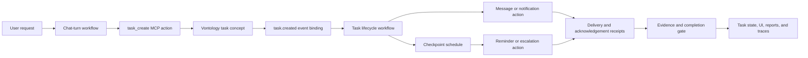

# Von MVP Task and Messaging Alignment

Date: 2026-04-24  
Source: `C:\Users\mwit860\OneDrive - The University of Auckland\Downloads\VON MVP look like.docx`

## Purpose

This note explains how the intent in the MVP mock-up document can be satisfied by Von, and which roles and actions implied by its MCP framing still need to be implemented.

The document is aligned with Von's direction if it is treated as a user-facing view over represented task, workflow, messaging, evidence, and role state. It should not become a separate flat task tracker. The authoritative state should remain in Vontology concepts, VWL workflow definitions, event bindings, schedules, prompt/programme artefacts, and typed evidence records. Python and MCP tools should provide reusable execution and integration surfaces.

## Executive Summary

The MVP document describes a structured coordination system for research labs. A request should become a task record with an owner, report-to person, Von role, status, checkpoint, deadline, progress signal, evidence, notes, attachments, messages, reminders, confirmations, and completion.

Von already has much of the support surface:

- Vontology-backed task records with rich parity fields.
- REST and UI surfaces for task creation, inspection, editing, history, comments, attachments, and links.
- Internal MCP task tools for creating, updating, listing, searching, transitioning, linking, commenting on, and attaching to tasks.
- Vontology-backed direct messages with REST and UI surfaces.
- Workflow event integration for task creation, task status changes, and direct message creation.
- Workflow MCP tools for instances, execution, event bindings, and schedules.
- Knowledge and research support surfaces for paper metadata, paper ingestion, RAG, concept relations, and paper recommendation messaging.

The main gap is not the existence of a task object. The gap is the durable coordination policy around that object: represented roles, lifecycle milestones, messaging and reminder actions, evidence gates, meeting/calendar connectors, research-method support workflows, and lab-status reporting workflows.

## Architectural Interpretation

The mock-up should map to Von as follows:

- A "Task Number" is a human-facing reference code. The canonical identity remains the Vontology concept ID.
- Task fields are represented task attributes and relationships, not merely UI fields.
- The timeline is a task lifecycle workflow plus history and evidence events, not a loose list of labels.
- "Von Role" is a represented role-performance concept, not a prompt persona or hard-coded Python branch.
- "Send via chat", reminders, confirmations, and completion checks are workflow actions with receipts.
- Evidence is a typed provenance object or linked artefact, not only free text.
- The UI task page is a projection of authoritative state, not the source of authority.
- MCP tools are reusable execution surfaces under workflow control; they should not become the home of decision policy.

## Intent-to-Implementation Mapping

| MVP intent | Current Von support | Remaining implementation |
| --- | --- | --- |
| Turn a natural-language request into a structured task record | `TaskManagementService.create_task`, task REST routes, task UI, and `task_create` MCP already support rich fields. | Author lab-specific task-construction workflows/prompts that infer task type, owner, report-to, deadlines, checkpoints, expected evidence, and role from the turn context. |
| Preserve owner, report-to, priority, type, status, checkpoint, evidence, notes, and attachments | These are already represented in task service, ontology service, task routes, task panel, comments, attachments, and task MCP tools. | Harden canonical predicates for participant roles, watchers, reviewers, escalation targets, and typed evidence receipts. |
| Display a lifecycle such as Created -> Sent -> Reminder -> Confirmed -> Complete | Task history and status updates exist; workflow event integration can launch workflows on task events. | Define canonical task milestone concepts and workflow-produced timeline events instead of deriving the timeline from generic history alone. |
| Send task context through chat | Direct messages exist as Vontology concepts with REST/UI support, and `message.direct_created` events can launch workflows. | Expose generic direct-message send/reply/search/read operations as internal MCP tools so workflows can use the same authoritative messaging path. |
| Remind people before deadlines | Workflow schedules and task due dates exist as support surfaces. | Implement reminder workflows that bind task deadlines/checkpoints to schedules, record delivery receipts, and escalate if acknowledgement is missing. |
| Confirm progress or completion | Task statuses, comments, attachments, evidence text, and worklogs exist. | Implement confirmation-request and completion-gate workflows that check expected progress signals and evidence before marking work complete. |
| Coordinate paper deadlines between professor and student | Task model can represent the deadline and ownership; research/paper tools can retrieve paper context. | Implement paper-submission tracking workflows with checkpoint schedules, evidence expectations, and role-aware messaging. |
| Arrange a Google Meet or Rolemation channel | Von has messaging concepts and workflow infrastructure. | Implement calendar/meeting/channel MCP actions such as `calendar_create_event`, `meeting_link_create`, and `rolemation_send_message`, with auth, receipts, and namespace checks. |
| Bring in recent relevant papers, methods, and citations | Paper metadata, paper download/finalisation, RAG, KB search, concept relations, and recommendation messaging surfaces exist. | Implement represented workflows for method-issue support, citation suggestion, paper tracking, and evidence-backed recommendation recording. |
| Produce weekly lab meeting updates from active tasks | Task list/search/history surfaces exist. | Implement lab-status reporting workflows that reconstruct task state by person/project, identify blockers, and distinguish evidence-backed status from missing evidence. |
| Track current students, past students, papers, affiliations, and trajectories | Vontology can represent people, roles, organisations, papers, and relationships. | Define canonical memory schemas and workflows for lab membership, student trajectories, paper stewardship, alumni tracking, privacy, and consent-aware outreach. |

## Current Implementation Anchors

The relevant existing support surfaces are:

- `src/backend/services/task_management_service.py`
  - Vontology-backed task creation and update logic.
  - Rich task fields: assignee, creator, source, report-to, task role, next checkpoint, progress signal, evidence, notes, reference code, priority, start date, due date, epic, components, fix versions, sprint, and backlog rank.
  - Task history events and best-effort workflow launch on task creation/status changes.
- `src/backend/services/task_ontology_service.py`
  - Canonical task predicates and task type definitions.
  - Existing task source, report-to, task role, checkpoint, progress signal, evidence, and reference-code predicates.
- `src/backend/server/routes/task_routes.py`
  - Task creation/update/list/search/history/comment/attachment/link surfaces.
- `src/frontend/web/von_interface/static/js/components/taskPanel.js`
  - User-facing task inspector with fields matching the MVP mock-up closely.
  - Timeline rendering based on task history.
- `src/backend/services/message_service.py`
  - Vontology-backed direct messages with sender, recipient, thread, reply, body, metadata, organisation scope, visibility, and workflow launch.
- `src/backend/server/routes/message_routes.py`
  - Authenticated direct-message REST surface and episode logging.
- `src/frontend/web/von_interface/static/js/components/messagePanel.js`
  - User-facing message thread UI.
- Internal MCP task tools
  - `task_create`, `task_get`, `task_list`, `task_search`, `task_update_fields`, `task_get_transitions`, `task_transition`, `task_assign`, `task_update_status`, `task_add_comment`, `task_add_attachment`, `task_add_worklog`, `task_get_history`, `task_create_subtask`, `task_link`, and related operations.
- Internal MCP workflow tools
  - Workflow definition listing, validation, instance creation, execution, traces, event bindings, schedules, schedule triggering, cancellation, and retry.
- Research and KB tools
  - Paper metadata/download/finalisation, paper recommendation delivery, KB search, concept creation, relationship creation, RAG operations, and related concept lookup.

## Roles Implied by the MVP

The mock-up names "Communicator" as a Von role. That should become one role in a broader represented role system.

Recommended first-class roles:

| Role | Responsibility | Current status |
| --- | --- | --- |
| Task steward | Convert requests into structured task records and maintain task state. | Partly supported by task service, UI, and MCP task tools; role policy still needs represented workflow/prompt authority. |
| Communicator | Deliver task context to the right people through the right channel. | Direct messages exist; generic workflow-addressable MCP message actions are still missing. |
| Reminder and escalation steward | Schedule reminders, request acknowledgements, and escalate overdue work. | Workflow schedules exist; task-specific reminder/escalation workflows remain to be authored. |
| Meeting scheduler | Create meeting invitations, meeting links, and participant-specific context. | Not yet implemented as a confirmed MCP action surface. |
| Research-context aide | Retrieve relevant papers, methods, prior project context, and related concepts. | KB/RAG/paper surfaces exist; task-bound research support workflows remain to be authored. |
| Paper and citation steward | Track papers, citations, deadlines, submission artefacts, and evidence. | Paper tools exist; canonical paper-submission workflow remains to be implemented. |
| Lab-status reporter | Produce weekly updates by reconstructing task state across people and projects. | Task/search/history surfaces exist; report workflow remains to be implemented. |
| Evidence auditor | Check that completion claims match expected evidence and provenance. | Evidence fields exist; typed evidence receipts and completion gates remain to be implemented. |
| Team memory curator | Maintain represented knowledge about students, alumni, collaborators, teams, roles, and trajectories. | Vontology can support this; canonical schemas and workflows remain to be authored. |
| Outreach scout | Identify external teams, prior students, or paper authors worth contacting and prepare outreach. | Research surfaces provide input; outreach workflows and send-with-approval actions remain to be implemented. |

These roles should be represented objects with capabilities, constraints, performance traces, and evaluable outcomes. They should not be implemented as a switch statement over role names.

## MCP Actions Still Needed

The task MCP surface is relatively mature. The missing MCP work is mostly around messaging, notifications, scheduling semantics, external collaboration channels, evidence, and research operations.

Recommended action surfaces:

| Action surface | Purpose |
| --- | --- |
| `message_send_direct` | Send a Vontology-backed direct message through the same path as the UI/REST messaging service. |
| `message_reply` | Reply in an existing represented thread. |
| `message_search` | Search message threads by participant, task, topic, or workflow instance. |
| `message_mark_read` | Record user-visible read state where appropriate. |
| `notification_send_channel` | Deliver a message through a selected channel while preserving task/workflow provenance. |
| `notification_delivery_status` | Retrieve delivery state for workflow diagnostics and escalation. |
| `notification_acknowledgement_record` | Record that a recipient acknowledged a reminder or request. |
| `task_schedule_checkpoint` | Bind a task checkpoint/deadline to a workflow schedule. |
| `task_request_confirmation` | Ask a participant to confirm progress, completion, or blocker status. |
| `task_confirm_progress` | Record a structured confirmation against the expected progress signal. |
| `task_record_evidence` | Attach typed evidence to a task, not only notes or comments. |
| `task_escalate_overdue` | Escalate a task according to represented workflow rules. |
| `calendar_create_event` | Create a calendar event with participants, agenda, task link, and provenance. |
| `calendar_update_event` | Update a represented calendar event from workflow context. |
| `meeting_link_create` | Generate or attach a meeting link for a scheduled meeting. |
| `meeting_invitation_send` | Send participant-specific invitations with task and context links. |
| `rolemation_send_message` | Deliver through the Rolemation channel, or through a generic channel adapter if Rolemation is one backend. |
| `paper_reference_context_build` | Build a task-bound context package of relevant references and methods. |
| `citation_suggest` | Suggest citations with evidence and provenance. |
| `paper_corpus_track` | Track a set of papers for updates, relevance, or downstream action. |
| `paper_relevance_review` | Record why a paper is relevant or not relevant to a task/project. |
| `research_method_issue_analyse` | Analyse a method problem against represented project context and literature. |
| `similar_methods_retrieve` | Retrieve similar method examples from the KB/paper corpus. |
| `method_recommendation_record` | Store an evidence-backed recommendation and link it to task/workflow state. |
| `lab_status_report_generate` | Generate a structured lab update from active task records and evidence. |
| `student_work_summary` | Summarise a person's current task state, blockers, recent evidence, and upcoming deadlines. |
| `blocker_detect` | Identify likely blockers from task history, missing evidence, messages, and overdue checkpoints. |
| `person_role_update` | Update represented person-role relationships with provenance. |
| `student_trajectory_record` | Record student/alumni trajectory facts with namespace and privacy controls. |
| `team_affiliation_link` | Link people, teams, organisations, projects, and papers. |
| `outreach_candidate_find` | Find candidate teams/authors/alumni for potential outreach. |
| `outreach_draft_message` | Draft outreach without sending it automatically. |
| `outreach_send_with_approval` | Send outreach only after the required confirmation or workflow approval. |
| `evidence_receipt_create` | Create a typed receipt for artefacts, confirmations, delivery events, or completion proof. |
| `artifact_link_to_task` | Link a file, URL, document, paper, or meeting artefact to a task with provenance. |
| `completion_gate_evaluate` | Decide whether a task can move to complete based on represented workflow criteria and evidence. |

These names are illustrative. The important point is that the action contract must be reusable, Vontology-aware, permission-aware, and workflow-callable.

## Workflow and Vontology Artefacts Needed

The following artefacts should be authored before treating the MVP as complete:

- Task intake workflow for research-lab coordination requests.
- Task lifecycle workflow with canonical milestones: created, delivered, acknowledged, reminder due, reminder sent, progress confirmed, evidence received, completion checked, completed, blocked, escalated, cancelled.
- Reminder and escalation workflow bound to task deadlines and checkpoints.
- Direct-message delivery workflow that records message receipts and links messages to tasks.
- Paper-submission tracking workflow.
- Research-method support workflow for retrieving comparable methods and evidence.
- Weekly lab-status reporting workflow.
- Meeting-scheduling workflow with participant context and task links.
- Evidence receipt type hierarchy and predicates.
- Participant-role schema: owner, reporter, reviewer, watcher, escalation target, sender, recipient, meeting participant, responsible role.
- Represented role-performance schema for Von roles such as Communicator, Task steward, Paper steward, and Lab-status reporter.
- Lab memory schema for students, alumni, supervisors, projects, papers, affiliations, placements, and privacy/consent state.

## Proposed Implementation Phases

### Phase 0: Canonical Mapping

Confirm the canonical Vontology concepts and predicates for tasks, participant roles, milestones, evidence receipts, messages, schedule bindings, and task-linked artefacts.

Output:

- Ontology mapping note.
- Any missing predicates or types created through Vontology pathways.
- Decision on which MVP fields are free text, typed relations, or derived workflow state.

### Phase 1: Workflow-Addressable Messaging

Expose the direct-message service as internal MCP actions and bind task-created/message-created events to workflows.

Output:

- Generic direct-message MCP actions.
- Message receipt records.
- Tests through the real MCP gateway path.
- Workflow trace showing task context delivered to a recipient.

### Phase 2: Task Lifecycle, Reminders, and Evidence

Author the canonical task lifecycle workflow and reminder schedule bindings.

Output:

- Milestone-producing workflow.
- Checkpoint and reminder schedules.
- Evidence receipt creation.
- Completion gate workflow.
- Task UI timeline backed by semantic milestones rather than generic history alone.

### Phase 3: Research-Lab MVP Workflows

Author the first lab workflows:

- Paper submission tracker.
- Meeting and action-follow-up workflow.
- Research-method issue workflow.
- Weekly lab-status report workflow.

Output:

- Replayable end-to-end examples.
- Telemetry showing workflow decisions, context, actions, and receipts.
- User-facing task records and messages.

### Phase 4: Role Learning and Team Memory

Make Von roles and lab memory first-class represented objects.

Output:

- Role objects with capabilities and constraints.
- Role-performance traces.
- Student/project/paper/team memory schemas.
- Evaluation cases for task-state reconstruction and role usefulness.

### Phase 5: External Connectors

Add the external action surfaces required by the MVP.

Output:

- Calendar and meeting actions.
- Rolemation or generic channel adapter actions.
- Email/send actions if required.
- Outreach actions with approval gates.
- Connector-specific receipts and error telemetry.

## Acceptance Evidence for MVP Readiness

Von should be considered aligned with this MVP only when the following real-path checks pass:

- A user request to track a paper deadline creates a task with owner, report-to, due date, checkpoint, Von role, progress signal, expected evidence, and a workflow instance.
- The task-created workflow sends the relevant message through a represented messaging path and records a delivery receipt.
- A reminder fires from a workflow schedule before the deadline and records acknowledgement or non-acknowledgement.
- If acknowledgement is missing, the task escalates according to represented workflow policy.
- Completion is blocked or qualified when expected evidence is missing.
- A weekly lab update reconstructs active tasks by person/project and explicitly marks uncertain or evidence-missing status.
- A research-method question retrieves relevant papers/methods, records the evidence used, and links the recommendation back to the task.
- The same state is visible through the UI task page, MCP task tools, workflow traces, and Vontology queries.
- No durable task, role, routing, reminder, or completion policy lives only in Python.

## Anti-Patterns to Avoid

- Do not make the mock-up UI fields the authority instead of Vontology/workflow state.
- Do not make the human-facing task number the canonical task identity.
- Do not hard-code research-lab coordination policy in Python.
- Do not implement "Von Role" as a prompt persona or string switch.
- Do not treat "message sent" as equivalent to "recipient acknowledged" or "task progressed".
- Do not store enduring paper, student, or alumni knowledge only as task notes.
- Do not create workflow-specific one-off MCP tools where a reusable channel, evidence, message, calendar, or task action would do.
- Do not let execution summaries replace the answer users need.

## Target Flow

## Bottom Line

The MVP document is not asking Von to become a conventional task tracker. It is asking for a structured coordination layer where tasks, messages, reminders, evidence, and research context are represented, inspectable, workflow-driven, and useful to a lab.

Von is already close at the task-record and workflow-infrastructure level. The next implementation work should focus on represented lifecycle policy, workflow-addressable messaging, typed evidence, reminder/escalation workflows, role-performance objects, research-lab workflows, and the external connector MCP actions needed to communicate through real channels.
